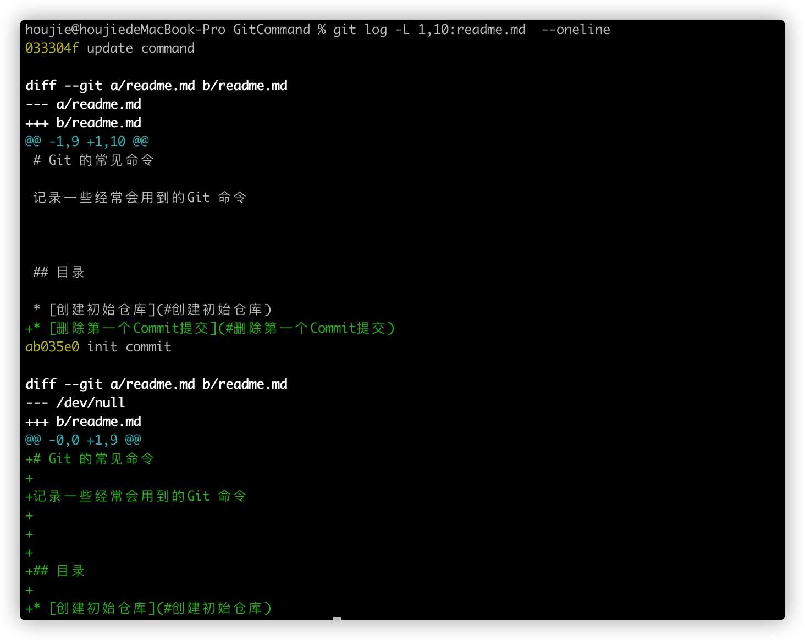
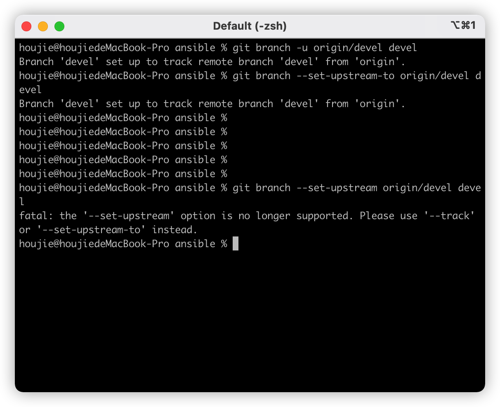

# Git 的常见命令

记录一些经常会用到的Git 命令


## 目录

* [创建初始仓库](#创建初始仓库)
* [删除第一个Commit提交](#删除第一个Commit提交)
* [查找Commit在哪个分支上](#查找Commit在哪个分支上)
* [查找某个文件在哪个Commit上被删除](#查找某个文件在哪个Commit上被删除)
* [查找某个文件被添加进repo时的Commit](#查找某个文件被添加进repo时的commit)
* [清除不被任何分支所有的Commit](#清除不被任何分支所有的Commit)
* [推送一个空提交的分支](#推送一个空提交的分支)
* [统计历史提交的Commit个数](#统计历史提交的Commit个数)
* [找到一个empty_tree对应的sha值](#找到一个empty_tree对应的sha值)
* [GitDiff时获取完整的file_sha](#GitDiff时获取完整的file_sha)
* [查看git_unpacked_object和磁盘占用空间](#查看git_unpacked_object和磁盘占用空间)
* [Git提交后重设Author](#Git提交后重设Author)
* [查看某个文件特定行数的修改历史](#Git查看某个文件指定行的修改历史)
* [修改某个分支追踪的上游](#修改某个分支追踪的上游)
* [Git显示颜色](#Git显示颜色)
* [查看当前commit与最近的一个tag之间的关系](#查看当前commit与最近的一个tag之间的关系)


## 创建初始仓库

```bash
git init repo
```


## 删除第一个Commit提交

```bash
git update-ref -d HEAD
```


## 查找Commit在哪个分支上 

```bash
git branch -r --contains commitid
```


## 查找某个文件在哪个Commit上被删除

```bash
git log --oneline --full-history -- prospector
```


## 找回丢失的Commit

当我们进行reset 或者删除分支操作后,对应的Commit 会消失,如果想要查找这些消失的Commit,可以使用如下命令

```bash
git fsck --lost-found
```


## 清除不被任何分支所有的Commit

**谨慎使用**

在一个分支上开发，有一些commit没有merge进master，后来放弃这个分支，不想继续开发了，那么这些没merge的commit就丢失了，称为dangling。

```bash
git reflog expire --expire-unreachable=now --all
git gc --prune=now
```


## 查找某个文件被添加进repo时的Commit

```bash
# 示例仓库(github.com/git/git)
git log --no-merges --diff-filter=A builtin-*.c 
```


## 推送一个空提交的分支

```bash
commit_id=$(git commit-tree -m 'Distribution branch' 4b825dc642cb6eb9a060e54bf8d69288fbee4904)
git push origin ${commit_id}:refs/heads/dist
```

```
4b825dc642cb6eb9a060e54bf8d69288fbee4904 is a special hash value in git which denotes an empty tree. And it does not change from repo to repo.
```


## 统计历史提交的Commit个数

```bash
git rev-list --all --count
```


## 找到一个empty_tree对应的sha值

```bash
git hash-object -t tree /dev/null
4b825dc642cb6eb9a060e54bf8d69288fbee4904

#the SHA-256 empty tree hash ID is:
6ef19b41225c5369f1c104d45d8d85efa9b057b53b14b4b9b939dd74decc5321
```


## GitDiff时获取完整的file_sha

```bash
git diff 946d60369589d6a269938edd65c0a6a7b1c3ef5c 3b990136bfab74249f166dd742fd8e61637e63d9 --full-index
```


## 查看git_unpacked_object和磁盘占用空间

```bash
git count-obbject -v —H
```


## Git提交后重设Author

```bash
git commit --amend --reset-author
```


## Git查看某个文件指定行的修改历史

``` shell
git log -L {start_line,end_line}:{file_name}
```




## 修改某个分支追踪的上游

```shll

git branch --set-upstream-to your_remote/your_remote_branch your_local_branch
# or
git branch -u your_remote/your_remote_branch your_local_branch
```





## Git显示颜色

```shell
git config --global color.ui auto
```


## 查看当前commit与最近的一个tag之间的关系

```
git describe 
```

example: (以prometheus 项目为例)
```shell
houjie@houjiedeMacBook-Pro prometheus % git show --stat --oneline
f0ec619ee (HEAD -> main, origin/main, origin/HEAD) scrape: allow providing a custom Dialer for scraping (#10415)
 scrape/manager.go     |  7 ++++++-
 scrape/scrape.go      | 18 +++++++++++++++---
 scrape/scrape_test.go | 16 ++++++++--------
 3 files changed, 29 insertions(+), 12 deletions(-)
houjie@houjiedeMacBook-Pro prometheus %


houjie@houjiedeMacBook-Pro prometheus % git describe
v2.34.0-rc.0-27-gf0ec619ee
houjie@houjiedeMacBook-Pro prometheus %
```